# AI Productivity — Analyzing the Impact of AI on Operational Margins

**Course:** Machine Learning — A.A. 2025/26  
**Team Members:**
- Matilde Marucci / Captain — ID: 815501
- Camilla Cortopassi — ID: 812211
- Francesco Cocchi — ID: 812141


## Section 1 — Introduction

This project investigates the financial and operational impact of AI adoption in a digital agency context. The central question is: *when a company starts using AI tools to complete tasks faster, does it actually earn more?*

The dataset covers 3,248 tasks across multiple teams, task types, and pricing models. Each task includes information about hours worked, rework, quality scores, revenue, cost, and AI usage intensity. The unit of analysis is the single task or deliverable.

The phenomenon we are studying is what we call the **AI Productivity Paradox**: companies that adopt AI produce more in less time, yet their margins often stay flat or decline. This happens because efficiency gains are offset by hidden costs: unstable quality, increased rework and pricing models that no longer reflect the value produced.

Our analysis is structured around four research questions:
1. **RQ1** — Where is value created? Which tasks and contexts benefit most from AI?
2. **RQ2** — Where are losses incurred? What drives loss-making tasks?
3. **RQ3** — Does AI improve quality, or just speed?
4. **RQ4** — Is there a threshold beyond which AI becomes harmful to margin?

We also address three advanced questions on speed-quality trade-offs, rework thresholds, and pricing model sustainability.

## Section 2 Methods

The analysis follows the structure of the notebook `main.ipynb`, organised into eight sequential steps.

### 2.1 Setup and Import

The following Python libraries are used throughout the analysis:

| Library | Purpose |
|---|---|
| `numpy` | Numerical operations |
| `pandas` | Data manipulation and aggregation |
| `matplotlib` | Base plotting |
| `seaborn` | Statistical visualisations |
| `scipy` | Statistical tests (t-test, chi-square, Pearson) |
| `missingno` | Missing value visualisation |

To reproduce the environment, run one of the following commands from the project root:

```bash
# Using conda
conda env export > environment.yml
conda env create -f environment.yml

# Using pip
pip freeze > requirements.txt
pip install -r requirements.txt
```

### 2.2 Data Loading and Initial Inspection

The raw CSV (`ai_productivity_dataset_final.csv`) is loaded into `raw_df`, which is never modified. All cleaning and transformations are applied to `final_df`, a working copy. 

Initial inspection via `.info()`, `.describe()`, and categorical summaries revealed several data quality issues: extreme outliers in `hours_spent` and `profit`, negative values in `billable_hours`, missing values across multiple columns, and non-unique `task_id` entries.

### 2.3 Categorical Variable Cleaning

Two columns required standardisation before analysis.

#### `team`:
 values were lowercased, stripped of whitespace, and corrected for typos (`contennt` → `content`, `desgn` → `design`)
 the low-frequency `paid_media` category was merged into `media`. 
 
#### `task_type`
 similar cleaning was applied (e.g. `relese` → `release`, `repport` → `report`) and low-frequency subcategories were merged into their parent categories (e.g. `blog_article` → `article`, `creative` → `design`). 
 
#### `jira_ticket` 
 was excluded from analysis as it is a pure identifier with ~10% missing values.

#### the others 
 `client_tier`, `seniority`, `pricing_model`, `task_status`, `workflow_stage`, `content_version`, `legacy_ai_flag`, `scope_change_flag`, `sla_breach`, `deadline_pressure` were inspected and required no cleaning. 

*Figure 1 – Distribution of `team` before and after cleaning*
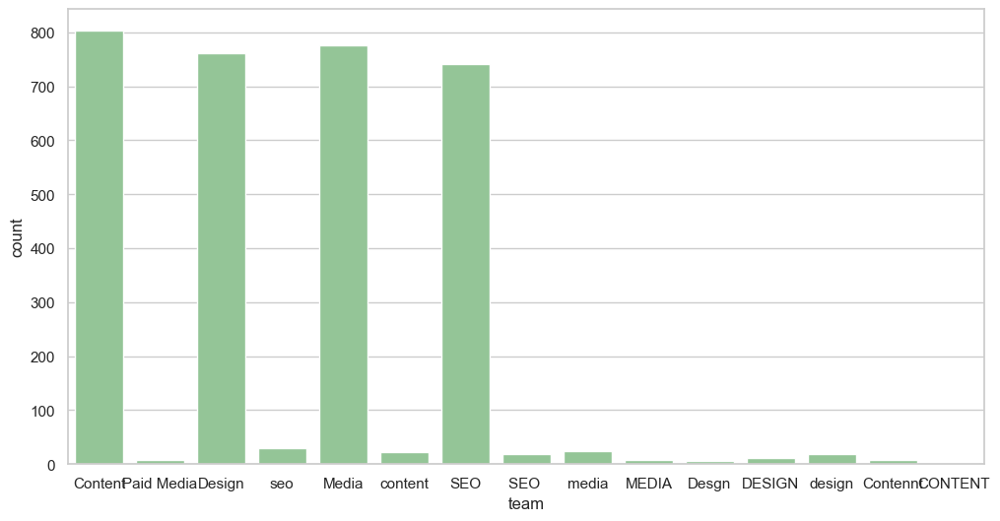 
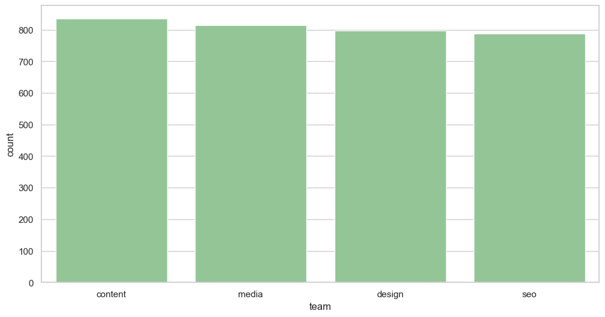 


*Figure 2 – Distribution of `task_type` before and after cleaning*
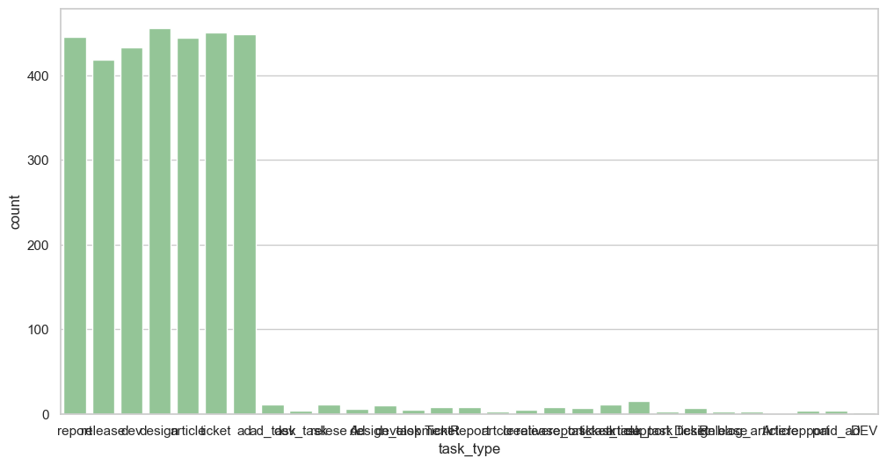
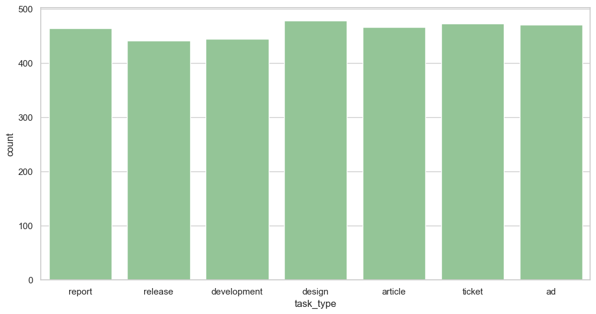

### 2.4 Date Variables Conversion

The columns `created_at`, `delivered_at`, and `updated_at` were stored as strings and converted to datetime objects using `pd.to_datetime()` with `errors="coerce"` to safely handle unparseable values (converted to `NaT`).

### 2.5 Missing Value Treatment

Missing values were treated column by column, each with a justified strategy:

- **`brief_quality_score`** (~2.1% missing): MCAR confirmed via group comparison; imputed with column median.
- **`sla_days`**: MCAR confirmed; imputed with column median.
- **`ai_usage_pct`** (~4.5% missing): MCAR confirmed. Notably, tasks with `legacy_ai_flag == True` showed median `ai_usage_pct` of 0.34%, confirming the flag reflects older-generation AI tools, not zero usage. Imputed with column median.
- **`rework_hours`** (~2.2% missing): Rows where `errors == 0` and `revisions == 0` were imputed with zero; remaining missing values imputed with column median.
- **`outcome_score`**: MCAR confirmed via `task_status` and `workflow_stage`; imputed with column median.
- **`billable_hours`** (~2.5% missing): Group-based median imputation by `pricing_model` × `task_type` to preserve business structure.
- **`delivered_at`**: Left unimputed at this stage; the few tasks marked as delivered but missing `delivered_at` were handled later in feature engineering using mean delivery duration.

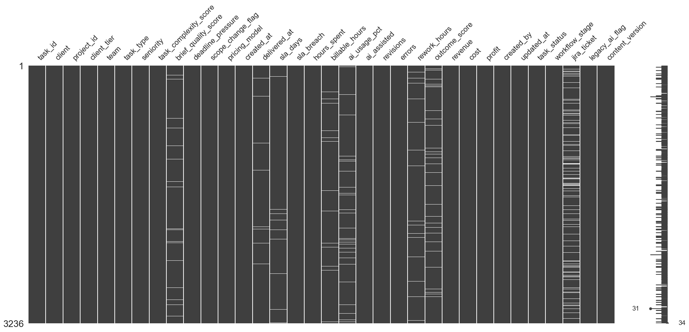
*Figure 3 – Missing value pattern across all columns*

### 2.6 Exploratory Data Analysis (EDA)

The EDA phase examined distributions and inter-variable relationships. 
A correlation heatmap over all numerical variables identified key patterns: 
- strong positive correlations between `billable_hours` and `cost` (0.55), `ai_usage_pct` and `ai_assisted` (0.64), and `revenue` and `profit` (0.77); 
- notable negative correlations between `sla_days` and `sla_breach` (-0.62), `errors` and `outcome_score` (-0.47), and `cost` and `profit` (-0.41). 

Histogram analysis showed strong right-skewness in `hours_spent`, `billable_hours`, `rework_hours`, `revenue`, and `cost`; a roughly left-normal distribution in `outcome_score`; and a bimodal distribution in `profit` suggesting structurally different task segments. 

Categorical distributions were examined via countplots, and boxplots were used to compare `ai_usage_pct` and `outcome_score` across all categorical variables.

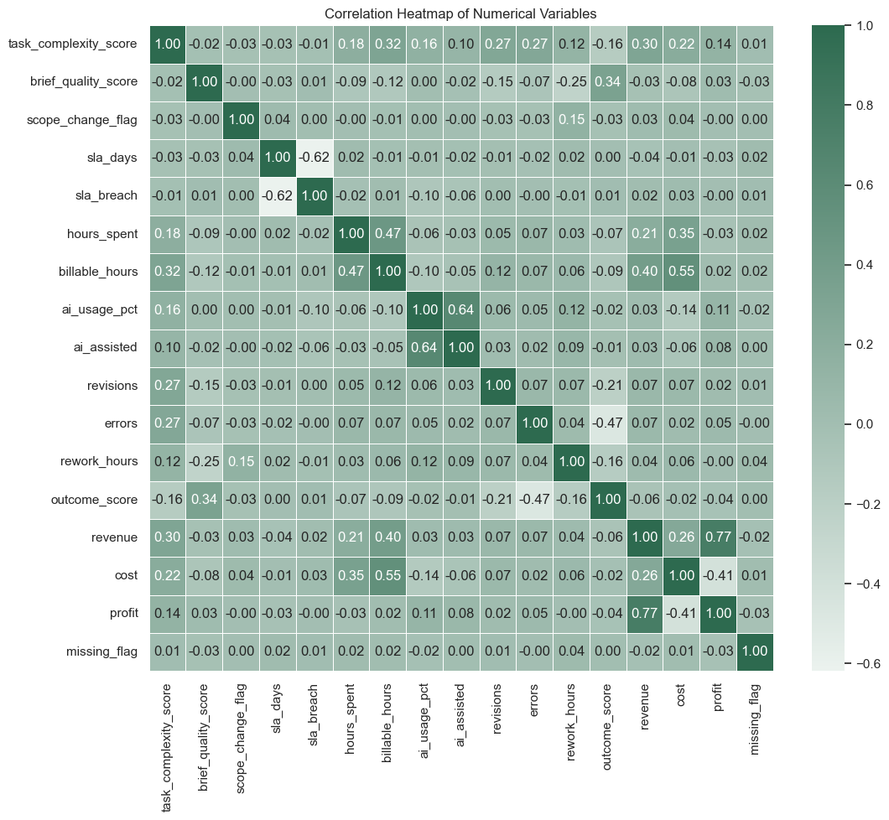
*Figure 4 – Correlation heatmap of all numerical variables*


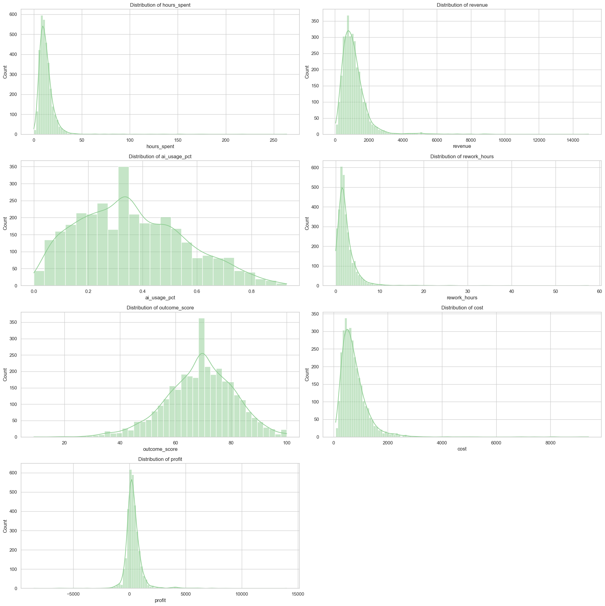
*Figure 5 – Histograms of `hours_spent`, `revenue`, `ai_usage_pct`, `rework_hours`, `outcome_score`, `cost`, `profit`*

### 2.7 Feature Engineering

This step covered inconsistency fixes, AI-related variable resolution, and the creation of derived metrics.

**Inconsistency fixes:**
- Negative `billable_hours` values were replaced with the column median.
- 14 rows where `created_at > delivered_at` were corrected by swapping the two date columns.
- `sla_breach` was fully recomputed as `delivery_time > sla_days` after a consistency check revealed ~1% mismatch with the original variable.
- `delivered_at` was imputed for the 38 remaining missing cases using mean delivery duration.
- `delivery_time` (days from creation to delivery) was computed as a derived variable.

**AI variable resolution:**
- `ai_usage_pct` was binned into five groups (`ai_group`): 0–15%, 15–30%, 30–50%, 50–75%, 75–100%.
- 685 rows had `ai_assisted == False` but positive `ai_usage_pct`. These were resolved using a median threshold: rows above the threshold were reclassified as `ai_assisted = True`; rows at or below were set to `ai_usage_pct = 0`.
- `ai_complexity` was created as the product of `task_complexity_score` and `ai_usage_pct`.

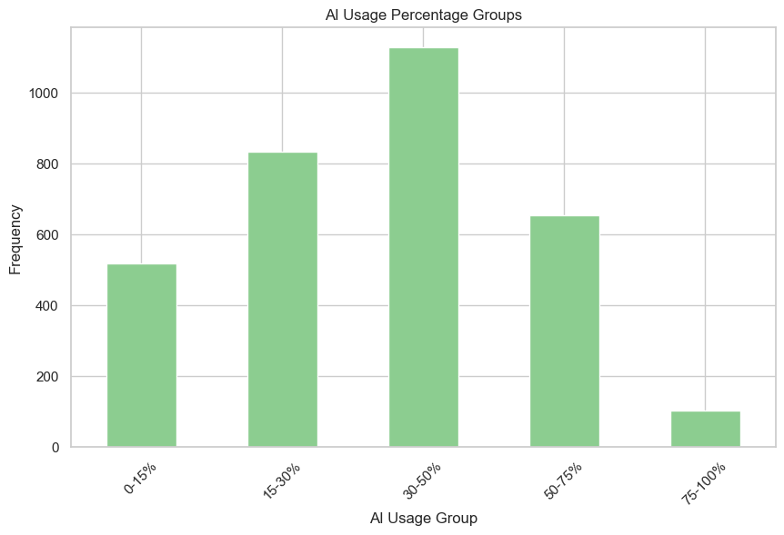
*Figure 6 – Distribution of  `ai_group` bins after refinement*

**Derived metrics:**

| Feature | Formula | Interpretation |
|---|---|---|
| `rework_ratio` | `rework_hours / (hours_spent + rework_hours)` | Share of total time spent on corrections |
| `cost_ratio` | `cost / revenue` | Cost absorbed per unit of revenue |
| `efficiency` | `billable_hours / hours_spent` | Share of time that is billable |
| `error_rate` | `errors / hours_spent` | Errors per hour worked |
| `revisions_rate` | `revisions / hours_spent` | Revisions per hour worked |
| `profit_margin` | `profit / revenue` | Net margin retained per task |
| `profit_per_hour` | `profit / hours_spent` | Profitability per hour worked |
| `is_loss` | `1 if profit < 0` | Binary flag for loss-making tasks |

Three rework cost scenarios (optimistic ×0.5, normal ×1.0, pessimistic ×1.5) were also computed to model the financial sensitivity of rework exposure.

### 2.8 Drop Identifier Columns

The columns `task_id`, `jira_ticket`, `created_by`, `project_id`, and `missing_flag` carry no analytical or predictive value and were dropped from `final_df` before analysis.

**Pipeline overview:**

```
Raw CSV
  └─► Data Inspection & Duplicate Removal
        └─► Categorical Cleaning (team, task_type)
              └─► Date Conversion
                    └─► Missing Value Treatment
                          └─► EDA
                                └─► Feature Engineering
                                      └─► Drop Identifiers
                                            └─► Research Questions (RQ1–4, Advanced)
```


## Section 3 Experimental Design

### RQ1 – Where is value created?

**Purpose:** Determine whether AI-assisted tasks generate higher profit margins and better cost efficiency than non-assisted ones.

**Baseline:** Mean profit margin and cost ratio across the full dataset.

**Methods:** Two-sample t-tests[^1] comparing AI-assisted vs. non-assisted groups on `profit_margin`, `profit_per_hour`, `cost_ratio`, `efficiency`, and `revenue`. 
Results reported at α = 0.10, 0.05, and 0.01. Profitability was further broken down by `ai_group` (bar chart), and by the interaction of `task_type` × `ai_group` and `team` × `ai_group` (heatmaps). 
A three-scenario analysis (optimistic / normal / pessimistic rework costs) tested the robustness of the findings.

**Evaluation metrics:** `profit_margin`, `cost_ratio`, `profit_per_hour`


### RQ2 – Where are losses incurred?

**Purpose:** Identify which task types, teams, seniority levels, and client tiers are most exposed to losses, and assess whether AI usage reduces that exposure.

**Baseline:** Mean loss rate across all tasks.

**Methods:** Two-sample t-tests[^2] on `rework_hours`, `rework_ratio`, `revisions`, `error_rate` between AI-assisted and non-assisted groups. Loss rate (`is_loss`) compared across `task_type`, `team`, `seniority`, and `client_tier` (bar charts). 
Loss rate by `ai_group` plotted and computed under all three rework cost scenarios.

**Evaluation metrics:** `is_loss`, `rework_ratio`, `error_rate`, `revisions_rate`, `cost_ratio`

### RQ3 – AI → quality or just speed?

**Purpose:** Disentangle whether AI's main effect is faster delivery, higher quality output, or both.

**Baseline:** Delivery time, SLA breach rate, and outcome score for non-AI-assisted tasks.

**Methods:** Two-sample t-tests[^3] on `hours_spent` and `delivery_time`; chi-square test on `sla_breach` (binary variable). 
A composite `quality_index` (normalised outcome score minus normalised rework ratio) and `speed_index` (1 minus normalised SLA ratio) were computed per task and averaged by `ai_group` to separate the two dimensions visually.

**Evaluation metrics:** `delivery_time`, `sla_breach`, `outcome_score`, `quality_index`, `speed_index`


### RQ4 – When does AI become negative?

**Purpose:** Identify the critical AI usage threshold below which partial adoption hurts profit margins more than no adoption at all.

**Baseline:** Average profit margin of tasks in the 0–15% AI usage bucket.

**Methods:** Tasks were sorted by `ai_usage_pct` and a rolling average [^4] (window = 500, centred) of `profit_margin` was computed to smooth noise and expose the underlying trend. 
The negative-margin zone was identified and bounded with vertical markers. No parametric assumptions were required.

**Evaluation metrics:** `profit_margin` (rolling average over `ai_usage_pct`)


### Advanced RQ1 – Speed vs. Quality trade-off

**Purpose:** Test whether faster delivery comes at the cost of lower output quality.

**Baseline:** Null hypothesis of zero correlation between `speed_index` and `quality_index`.

**Methods:** Pearson correlation between `speed_index` and `quality_index` across all tasks, with scatter plot and regression line overlay.

**Evaluation metrics:** Pearson r, p-value


### Advanced RQ2 – Rework threshold

**Purpose:** Assess whether high rework ratio is a reliable predictor of profit margin erosion.

**Baseline:** Null hypothesis of zero correlation between `rework_ratio` and `profit_margin`.

**Methods:** Pearson correlation between `rework_ratio` and `profit_margin`, repeated under all three rework cost scenarios. Scatter plots with regression lines used to visualise the relationship and check for non-linearity.

**Evaluation metrics:** Pearson r, p-value, `profit_margin` under three cost scenarios


### Advanced RQ3 – Hourly pricing model sustainability

**Purpose:** Determine under which conditions the hourly pricing model generates losses, and whether seniority and AI usage are the key drivers.

**Baseline:** Profit margin of fixed and value-based pricing models.

**Methods:** Six candidate loss drivers (`rework_ratio`, `error_rate`, `task_complexity_score`, `hours_spent`, `billable_hours`, `seniority`) compared between the hourly model and others using boxplots (numerical) or grouped bar charts (categorical). 
The seniority signal was then decomposed into a three-panel chart of mean profit margin by `ai_group` for junior, mid, and senior workers under the hourly model.

**Evaluation metrics:** `profit_margin` by `pricing_model`, `seniority`, `ai_group`

## Section 4 Results

### Main Findings

**RQ1 – Value creation:** AI-assisted tasks show a higher average profit margin (0.16 vs. 0.08) and lower cost ratio (0.84 vs. 0.92), both significant at the 10% level. Profit margin increases nearly monotonically with AI usage intensity, peaking at ~34% for the 75–100% group. Tasks in the 15–30% usage range are the exception, showing a dip below even the 0–15% group, consistent with a transition-phase effect.

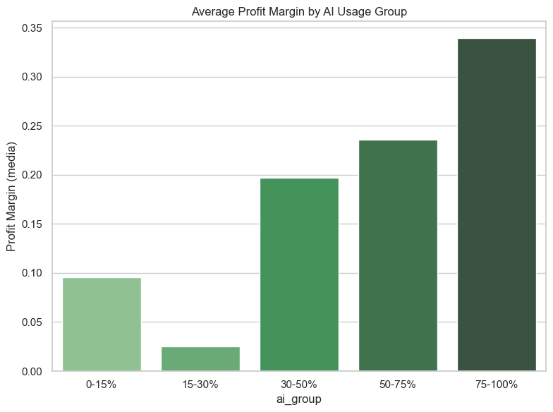
*Figure 7 – Average profit margin by `ai_group` (RQ1)*


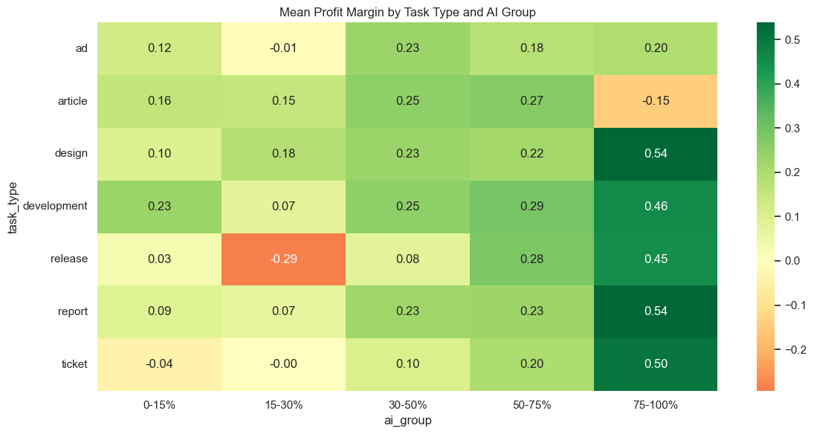
*Figure 8 – Mean profit margin by `task_type` × `ai_group` (RQ1)*


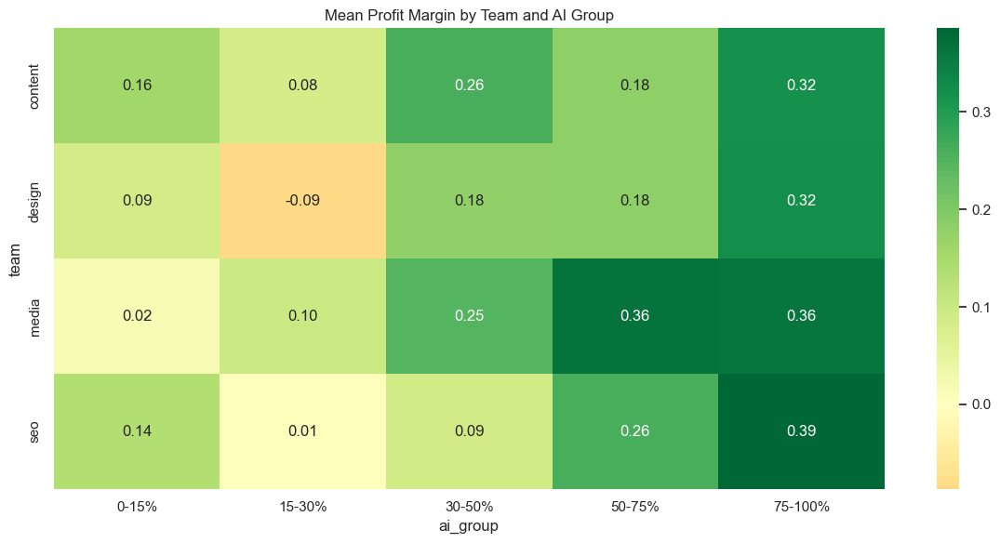
*Figure 9 – Mean profit margin by `team` × `ai_group` (RQ1)*


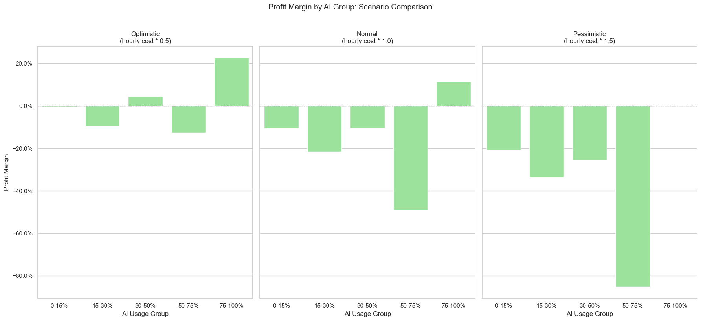
*Figure 10 – Profit margin by `ai_group` under optimistic / normal / pessimistic rework cost scenarios (RQ1)*


**RQ2 – Losses:** Rework hours and rework ratio are significantly higher in AI-assisted tasks (p < 0.01), but loss rate falls monotonically with AI usage: from ~30% in the 0–15% group to ~12% in the 75–100% group. Senior workers lose on 45% of tasks vs. 11% for juniors, likely reflecting task allocation patterns rather than individual performance.

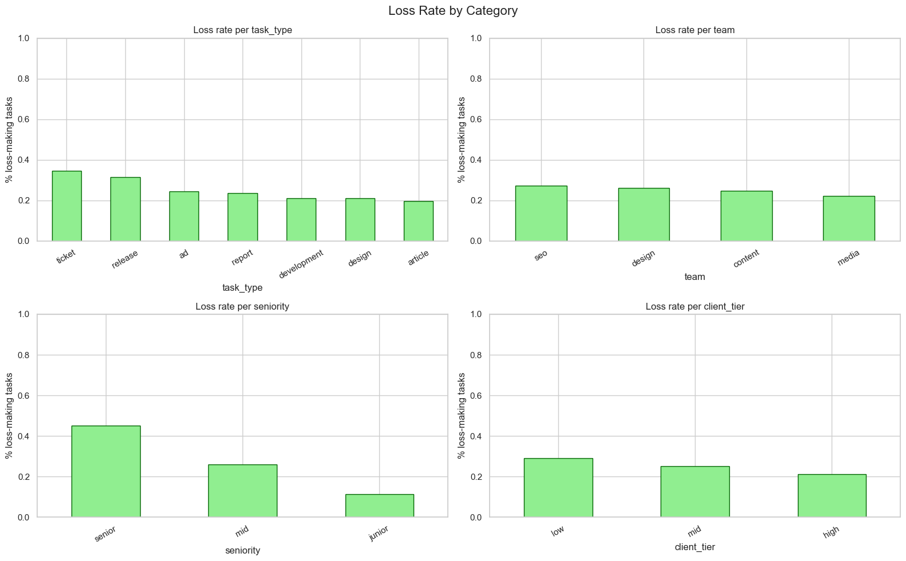
*Figure 11 – Loss rate by `task_type`, `team`, `seniority`, and `client_tier` (RQ2)*


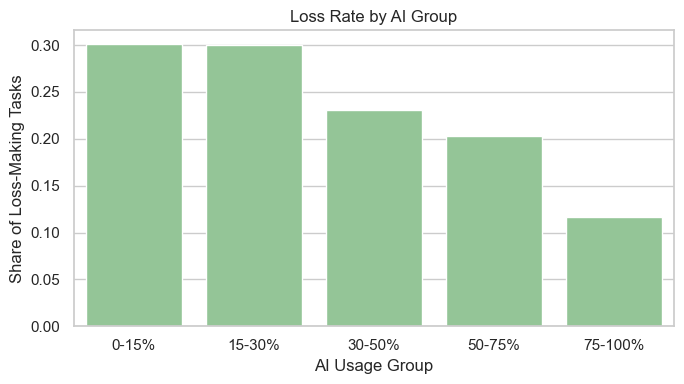
*Figure 12 – Loss rate by `ai_group` (RQ2)*


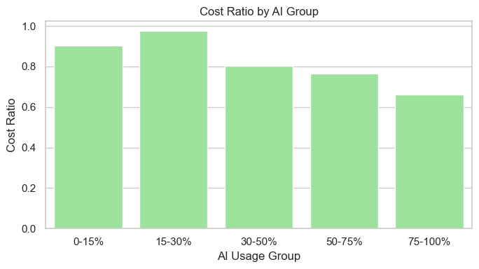
*Figure 13 – Cost ratio by `ai_group` (RQ2)*


**RQ3 – Quality vs. Speed:** AI-assisted tasks are delivered faster (4.43 vs. 4.91 days, p < 0.01) and breach SLAs less often (38% vs. 47%, p < 0.01). However, `outcome_score` shows no statistically significant difference (p = 0.597). The `quality_index` declines with AI usage while `speed_index` remains stable, suggesting AI accelerates delivery without improving — and possibly slightly reducing — output quality.

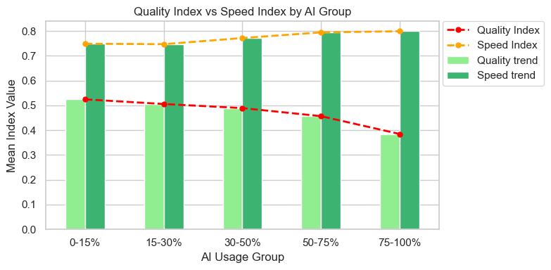
*Figure 14 – Quality index vs. speed index by `ai_group` (RQ3)*


**RQ4 – Critical threshold:** The rolling average of profit margin briefly turns negative around 20% AI usage. Below that zone, low-AI tasks hold a stable ~6% margin; above 30%, margins recover and grow to ~30% at high usage. Partial adoption (roughly 15–30%) is the riskiest configuration.

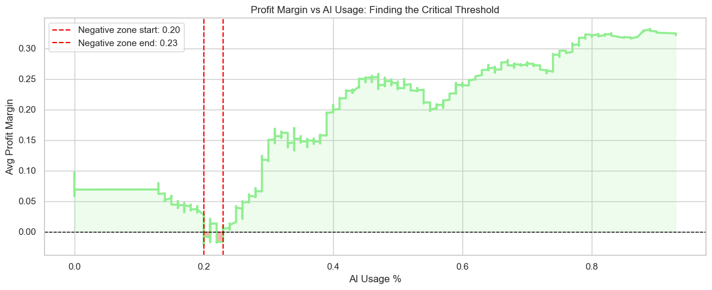
*Figure 15 – Rolling average profit margin vs. `ai_usage_pct` with negative zone highlighted (RQ4)*


**Advanced RQ1:** Pearson r = 0.002 (p = 0.891) — no trade-off between speed and quality. The two dimensions are independent.

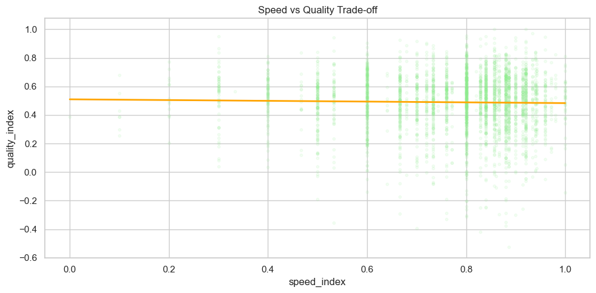
*Figure 16 – Scatter plot of `speed_index` vs. `quality_index` with regression line (Advanced RQ1)*

**Advanced RQ2:** Pearson r ≈ 0.008 (p = 0.638) in the base scenario. Rework ratio alone is not a reliable financial risk indicator; margin protection should focus on `cost_ratio` and pricing.


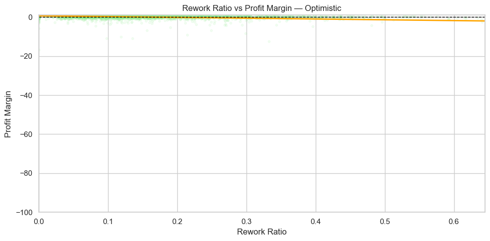
*Figure 17 – Rework ratio vs. profit margin under three cost scenarios (Advanced RQ2)*


**Advanced RQ3:** The hourly pricing model is structurally unsustainable for senior workers below 75% AI usage. Junior workers never collapse; mid-level workers go negative between 15–75% AI usage.

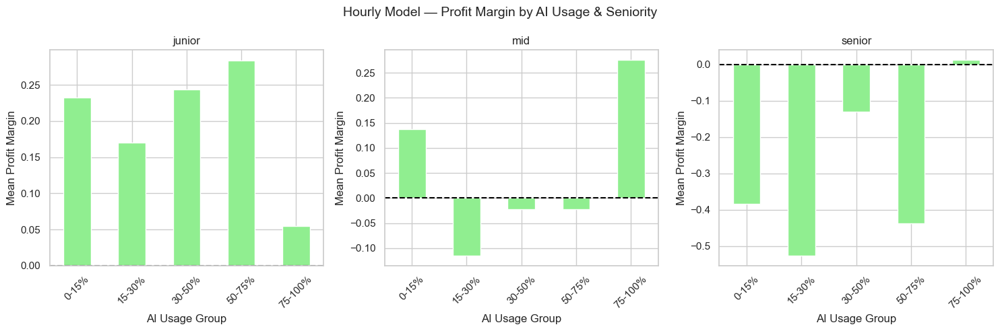
*Figure 18 – Mean profit margin by `ai_group` for junior / mid / senior under the hourly pricing model (Advanced RQ3)*

### Summary Table – Profit Margin by AI Usage Group

| AI Usage Group | Mean Profit Margin | Mean Loss Rate |
|---|---|---|
| 0–15% | ~0.08 | ~30% |
| 15–30% | ~0.025 | ~28% |
| 30–50% | ~0.15 | ~22% |
| 50–75% | ~0.23 | ~18% |
| 75–100% | ~0.34 | ~12% |

## Section 5 Conclusions

### Summary

This analysis shows that AI adoption in professional task workflows has a clear and consistent positive effect on financial performance — but only when it is adopted at sufficient intensity. Tasks where AI is used for more than 50% of the work achieve profit margins two to four times higher than low-adoption tasks, and their loss rates are cut by more than half. The critical risk zone lies between 15% and 30% AI usage, where partial adoption introduces overhead and inconsistency without yet delivering efficiency gains. Speed is AI's most reliable benefit: AI-assisted tasks are delivered faster and breach SLAs less often, with no statistically significant impact on outcome scores. The hourly pricing model emerges as a structural vulnerability for senior workers, where AI-driven speed reduces billable hours and erodes margins — pointing to a need for pricing model redesign for that segment.

### Limitations and Future Work

Several questions remain open. First, the dataset comes from a single company, which limits the generalisability of the findings: industry-specific dynamics, team culture, and client mix may all influence the results in ways that cannot be separated here. Second, the analysis is observational — no causal claims can be made about AI driving margin improvements, as confounders such as task selection bias (more structured, AI-friendly tasks may simply be assigned to AI users) cannot be ruled out. Third, the `outcome_score` metric may not fully capture output quality, particularly for creative or complex tasks where quality is harder to quantify. Natural next steps include building predictive models (e.g. regression or classification) to identify which task characteristics most reliably predict losses; conducting a longitudinal analysis to track whether AI adoption effects strengthen over time as workers accumulate experience; and designing a controlled experiment or quasi-experimental setup (e.g. difference-in-differences) to move closer to causal identification of AI's true productivity effect.

## Section 6 Prompt AI

### PROMPTS FOR AI BUCKETS:

Prompt 1: 
I want to bin ai_usage_pct into groups to use it as a categorical variable in bar plots. How many buckets should I use?

Prompt 2: 
You suggested 4 buckets but there’s a lot of observations in the 0-25% and 25-50% range, wouldn’t it make more sense to split those further? I don’t want to lose detail there. Would unequal bucket sizes be an issue?

### PROMPTS FOR VALUE METRICS:

Prompt 3: 
I have a dataframe with several performance metrics and a bool column ai_assisted. I want to statistically test whether using AI has a significant effect on those metrics. What’s a good approach?

Prompt 4: 
Ok great so t-test makes sense. My metrics are profit_margin, profit_per_hour, cost_ratio, efficiency, revenue. Can you show me how to split the final_df by ai_assisted and run a ttest_ind for each one?

Prompt 5: 
The output only prints p-value but I want to also see the values for both groups side by side, so I can actually tell if AI is better or worse, not just whether it’s significant

Prompt 6: 
You used only alfa = 0.01 but I want to show all three thresholds: 0.10, 0.05 and 0.01, since at 0.01 none of the results are significant. A result significant at 0.10 or 0.05 but not 0.01 is still useful information for me, I don’t want to throw it away.

### PROMPT FOR ESTIMATING REWORK HOURS COSTS

Prompt 7: 
I want to check if rework hurts profit margin but I’m not sure what rework actually costs the company and if extra hours are actually paid (it seems that). So beside the case that these extra hours are not paid I’m thinking to build three scenarios with different cost assumptions (normal, pessimistic and optimistic) instead of making the assumptions that the extra hours are paid ad the “normal” ones. Do you think that it could be a good strategy?

Prompt 8:
Ok now plot the three scenarios side by side (3 subplots) as bar charts by ai_group, with a zero line so I can immediately see which groups go negative in each case.

### PROMPT FOR LOSS METRICS

Prompt 9: 
Can you do the same thing used yesterday (t-test for value metrics) but for loss metrics: revisions, errors, rework_hours, rework_ratio, error_rate. Please use the same structure and the same thresholds.

Prompt 10: 
Do the same for testing speed metrics: hours_spent, delivery_time and sla_breach. Consider that sla_breach is a binary variable (0/1), so I can’t use a t-test on it. What test should I use instead?

### PROMPT FOR QUALITY VS SPEED DECOMPOSITION

Prompt 11: 
I have outcome_score and rework_ratio and I want to merge them into a single quality index. Same for speed: I have delivery_time and sla_days. The problem is that they’re on different scales so I can’t just average them. How do I normalize first?

Prompt 12: 
You normalized speed as sla_ratio_norm directly but that means higher values = slower, which is counterintuitive. I want the speed index to be higher when the task is faster, so I need to “reverse” it.

### PROMPT FOR TRESHOLD ANALYSIS

Prompt 13: 
I want to analyze at what point AI usage starts actually hurting profit margin like finding the threshold where it turns negative. I’ve never done threshold analysis before, what are the options?

Prompt 14: 
Ok can you give me the code for the main options you mentioned? I want to see them on ai_usage_pct vs profit_margin.

Prompt 15: 
Some of these approaches are too complex for what I need and the plots aren’t clear enough. I just want to visually see where the margin goes negative as AI usage increases.

Prompt 16: 
What’s the simplest way to smooth the data and plot it so the trend is readable? I have a lot of noise in the raw values.

Prompt 17: 
Add vertical dashed red lines to mark where the margin goes below zero and where it comes back up.

Prompt 18: 
Also fill the negative zone in red and keep the rest blue, so it’s immediately clear where the losses are.

### PROMPT FOR PEARSON (ADVANCED QUESTION 1)

Prompt 19: 
I want to check if there’s a trade-off between speed and quality using correlation between speed_index and quality_index. Is Pearson right or should I use something else?

Prompt 20: 
Ok, run the Pearson correlation and plot a scatter so I can see the relationship visually too.

Prompt 21: 
Add a regression line to the scatter, the dots alone are too noisy to read the trend.

### PROMPT FOR HOURLY BASED MODEL

Prompt 22: 
I want to understand why the hourly model is losing money. Can you compare it against fixed and value_based on a few variables (rework, errors, hours spent, seniority, complexity, billable hours) to see where the difference is.

Prompt 23: 
You made separate plots for each variable but I want them all in one figure so I can compare at a glance.

Prompt 24: 
Can you help me break down the hourly model by seniority and AI usage group? One bar chart per seniority level so I can see where the margin collapses.

## Section 7 Questions That Emerged During the Workflow

Are some tasks more likely to generate a loss? 

Where is value created? Where does AI create the most value - by task type and by team?

Where are losses incurred and by whom?

AI -> quality or just speed?

When Does AI Start Hurting the Margin? Is there a point where increasing AI usage makes profit margin worse before it gets better?

Is the hourly pricing model structurally unprofitable, or does it depend on who is doing the work?

Does AI usage reduce the share of loss-making tasks, and by how much compared to low-adoption groups?

Does higher AI usage reduce cost ratio, or does it add overhead that offsets the efficiency gains?

Are senior workers more likely to generate losses than junior ones, and what explains the gap?

Does AI reduce errors and revisions, or does it introduce more back-and-forth in the process?

Is rework ratio a reliable financial risk indicator, or does it not actually predict profit margin?

Which task types benefit most from AI adoption in terms of profit margin, and are there any where it backfires?

Does AI help teams deliver within SLA deadlines, or does it only reduce total delivery time?

Are there tasks where ai_assisted is flagged as False despite a positive ai_usage_pct, and how were they resolved?

Does AI reduce hours spent on a task, or does it only affect how fast the task gets delivered?

How sensitive is the loss rate to rework cost assumptions: does the picture change significantly across optimistic and pessimistic scenarios?

Do teams that use AI heavily maintain quality output, or does the quality index deteriorate as AI usage increases?

What is the optimal AI adoption strategy given all the evidence?

